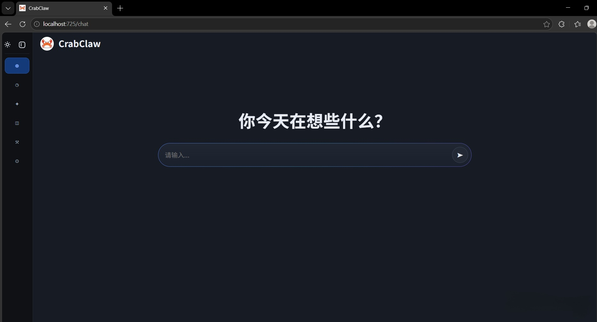
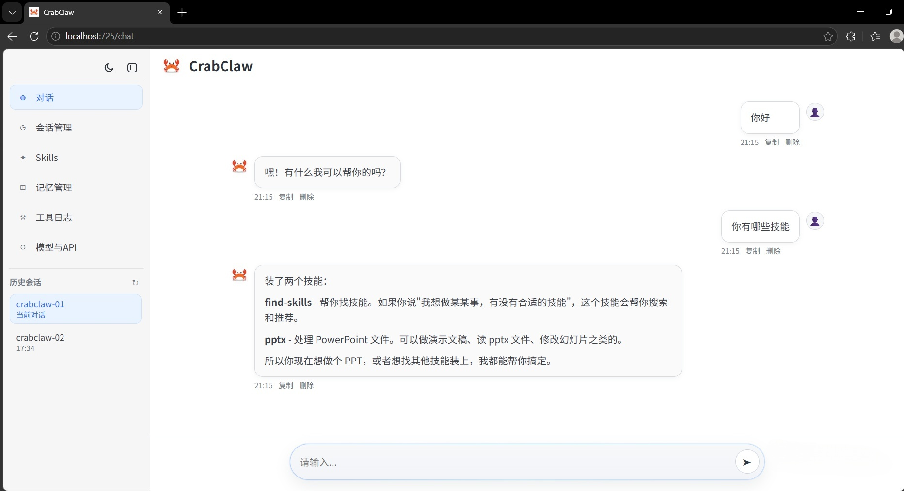

# 🦀CrabClaw

CrabClaw 参考了 OpenClaw（小龙虾）的思路，是一只更轻、更快、更接地气的 “小螃蟹”AI Agent协作助手。

## 🌟项目亮点

- 轻量高效：前后端分离，启动快、占用低
- 完整 Agent 能力：对话流式输出 + 短期 / 长期记忆+工具调用
- 技能化扩展：支持本地 / URL 一键安装 Skills
- 强大工具链：搜索、网页读取、文件操作、命令执行
- 友好界面：浅色 / 深色双模式，Vue3 + TypeScript 构建

## 🚀核心功能

- 智能对话：SSE 流式回复，上下文连贯自然
- 会话管理：创建、切换、删除、自定义会话信息
- 记忆系统：自动提炼记忆，支持手动编辑与持久化
- 技能中心：本地导入 / URL 下载 / 管理自定义技能
- 工具调用：联网搜索、网页解析、文件读写、系统指令
- 配置中心：在线修改模型参数、API Key、服务地址

## 界面预览

深色模式：



浅色模式：



## 🧩前端可操作

- 对话页：发送消息、流式回复、技能触发、单条消息管理
- 会话页：创建、切换、删除会话，支持自定义会话 ID
- 技能页：刷新、本地导入、URL 导入、卸载技能
- 记忆页：查看、编辑、保存、重置记忆文件
- 工具日志：实时查看工具执行记录
- 配置页：模型参数、API 密钥、服务地址在线配置

## 技术栈

| 层级 | 技术栈 |
| --- | --- |
| 后端 API | FastAPI, SSE-Starlette |
| Agent 引擎 | LangChain, LangChain OpenAI |
| 前端应用 | Vue 3, Vite, TypeScript |
| UI 组件 | Ant Design Vue |

## 环境要求

- Python 3.10+
- Node.js 18+
- npm 9+
- Windows / macOS / Linux（示例命令以 Windows PowerShell 为主）

## 项目框架

```text
crabclaw/
├─ backend/
│  ├─ app/
│  │  ├─ main.py          # FastAPI 入口
│  │  ├─ agent/           # Agent 主流程、同步/流式对话
│  │  ├─ api/             # chat/session/memory/skills/config 接口
│  │  ├─ memory/          # 记忆提炼、上下文保护
│  │  ├─ skills/          # Skills 注册与安装管理
│  │  ├─ tools/           # 内置工具与命令白名单策略
│  │  └─ workspace/       # 本地工作区与配置管理
│  └─ requirements.txt
├─ frontend/
│  ├─ app/
│  │  ├─ pages/           # Chat/Sessions/Skills/Memory/ToolLog/Config 页面
│  │  ├─ components/      # 侧边栏等通用组件
│  │  ├─ api/             # 前端 API 封装
│  │  ├─ routes.ts        # 路由入口
│  │  └─ main.ts          # 应用入口
│  └─ package.json
├─ data/                  # README 截图等静态资源
└─ README.md
```


## 快速开始（Windows）

### 1) 后端

```powershell
cd backend
pip install -r requirements.txt
Copy-Item .env.example .env
# 填写 .env 文件中的 LLM_API_KEY 和其他配置项
uvicorn app.main:app --reload --port 8000
```

### 2) 前端

```powershell
cd ../frontend
npm install
npm run dev
```

访问地址：

- 前端：http://localhost:725
- 后端：http://localhost:8000
- 健康检查：http://localhost:8000/health

## ⚙️配置说明

后端配置文件：`backend/.env`

至少需要配置：

```env
LLM_MODEL_ID=gpt-4o-mini
LLM_API_KEY=your-api-key
LLM_BASE_URL=https://api.openai.com/v1
```

常用可选项：

```env
LLM_TEMPERATURE=0.4
CORS_ORIGINS=http://localhost:725
WORKSPACE_PATH=~/.crabclaw/workspace
SERPAPI_API=
```
## 🔐安全机制

```text
1) 命令白名单：只允许授权命令执行
2) 目录白名单：只允许在授权目录读写与执行
3) 风险词拦截：自动拦截高危命令片段
4) 管道/重定向拦截：默认禁用 | && > 等组合
5) 超时与输出限制：防止长时间占用与超长输出
6) 执行审计日志：记录 execution_audit.log 便于追踪
```

## API接口

| 端点 | 方法 | 描述 |
| --- | --- | --- |
| `/health` | GET | 健康检查 |
| `/api/chat` | POST | 发送消息（SSE 流式） |
| `/api/chat/send` | POST | 发送消息（同步） |
| `/api/session/list` | GET | 获取会话列表 |
| `/api/session/create` | POST | 创建会话（支持自定义 session_id） |
| `/api/session/{session_id}/history` | GET | 获取会话历史 |
| `/api/session/{session_id}` | DELETE | 删除会话 |
| `/api/config/agent/info` | GET | 获取 Agent 信息 |
| `/api/config/llm` | GET/PUT | 获取/更新 LLM 配置 |
| `/api/memory/files` | GET | 获取记忆文件列表 |
| `/api/memory/content` | GET/PUT | 获取/更新记忆内容 |
| `/api/skills/list` | GET | 获取技能列表 |
| `/api/skills/install/local` | POST | 本地安装技能 |
| `/api/skills/install/url` | POST | URL 安装技能 |
| `/api/skills/{skill_id}` | DELETE | 卸载技能 |


## 📌未来规划

- 持续优化聊天体验，提升响应速度与稳定性
- 扩充常用 Skills 与实用工具，增强可用能力
- 优化会话与记忆管理，提升使用流畅度
- 提供更多开箱即用的配置与示例
- 完善文档与教程，降低上手成本

## 🙏致谢

- [LangChain](https://www.langchain.com/) - Agent 编排框架
- [FastAPI](https://fastapi.tiangolo.com/) - 后端框架
- [Vue.js](https://vuejs.org/) - 前端框架
- [Vite](https://vitejs.dev/) - 前端构建工具
- [Ant Design Vue](https://antdv.com/) - UI 组件库


## License

本项目基于 MIT License 开源，详见 [LICENSE](LICENSE)。
