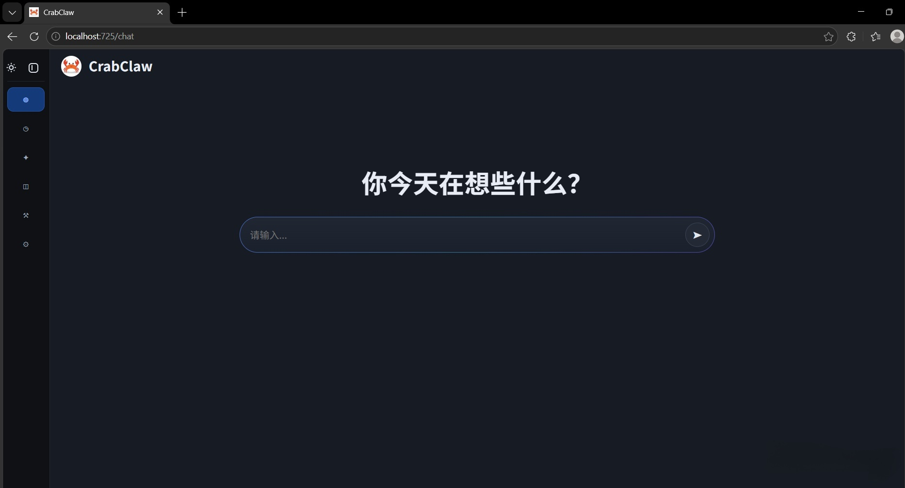
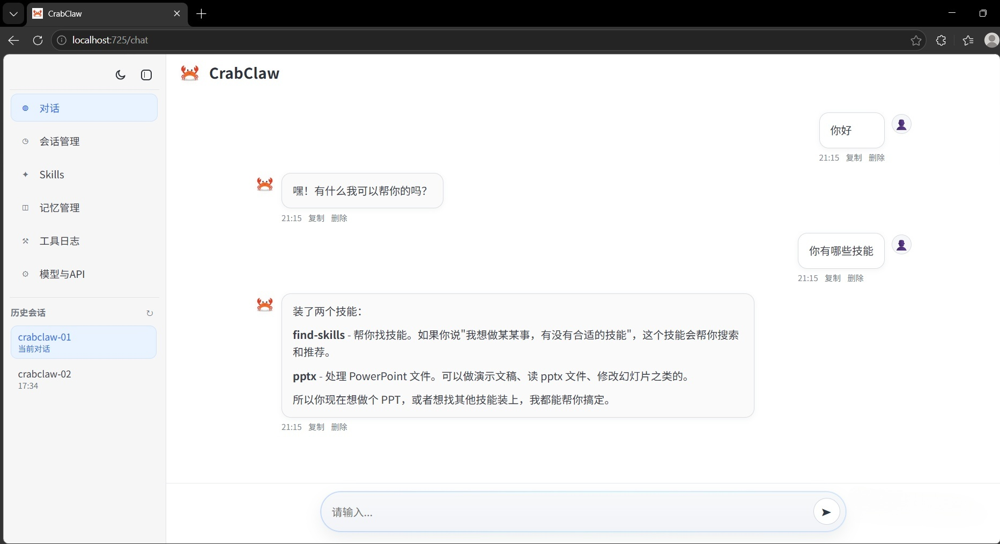

# 🦀 CrabClaw

CrabClaw 是一个轻量、实用的 AI Agent 个性化协作助手，前后端分离架构，支持 Web UI、CLI 终端双端交互。

## 🚀功能特性

### 双端共用
Web 界面和 CLI 终端共享同一套工作区、记忆和会话。

### 身份定制
可自定义 Agent 的身份和个性，打造专属的 AI 助手。
### 记忆系统
自动捕获偏好和决策，跨天反复提及的内容沉淀为长期记忆，支持关键词和语义混合搜索。

### 工具调用透明
Agent 调用工具时实时展示工具名称、参数和返回结果，不是黑盒。

### 命令安全
六层防护：命令白名单、目录沙箱、风险词拦截、管道禁用、超时控制、审计日志。

### 可扩展技能
内置代码审查、翻译、文档撰写，支持本地目录和 URL 远程安装自定义技能。

## 界面预览

深色模式：



浅色模式：



## 技术栈

| 层级 | 技术栈 |
| --- | --- |
| 后端 API | FastAPI, SSE-Starlette |
| Agent 引擎 | LangChain, LangChain OpenAI |
| 向量检索 | text-embedding-3-small, numpy 余弦相似度 |
| CLI 终端 | argparse, asyncio |
| 前端应用 | Vue 3, Vite, TypeScript |
| UI 组件 | Ant Design Vue |
| 状态管理 | Pinia |
| 代码质量 | ruff (Python), ESLint + Prettier (TS) |

## 环境要求

- Python 3.10+
- Node.js 18+
- npm 9+
- Windows / macOS / Linux

## 项目框架

```text
crabclaw/
├─ backend/
│  ├─ app/
│  │  ├─ main.py          # FastAPI 入口
│  │  ├─ agent/           # Agent 主流程、同步/流式对话
│  │  ├─ api/             # chat/session/memory/skills/config 接口
│  │  ├─ memory/          # 记忆系统（捕获/语义检索/上下文守卫/embedding）
│  │  ├─ cli/             # CLI 终端（main/repl/render/stream）
│  │  ├─ skills/          # Skills 注册与安装管理
│  │  ├─ tools/           # 内置工具 + 命令安全策略
│  │  └─ workspace/       # 本地工作区与配置管理
│  ├─ pyproject.toml      # ruff 配置 + CLI 入口点
│  └─ requirements.txt
├─ frontend/
│  ├─ app/
│  │  ├─ pages/           # Chat/Sessions/Skills/Memory/ToolLog/Config 页面
│  │  ├─ components/      # 侧边栏等通用组件
│  │  ├─ stores/          # Pinia 状态管理
│  │  ├─ api/             # 前端 API 封装
│  │  ├─ routes.ts        # 路由入口
│  │  └─ main.ts          # 应用入口
│  ├─ .eslintrc.cjs       # ESLint 配置
│  ├─ .prettierrc         # Prettier 配置
│  └─ package.json
├─ data/                  # README 截图等静态资源
└─ README.md
```

## 快速开始

### 1) 后端

```bash
cd backend
pip install -r requirements.txt
cp .env.example .env
# 填写 .env 文件中的 LLM_API_KEY 和其他配置项
uvicorn app.main:app --reload --port 8000
```

### 2) 前端

```bash
cd frontend
npm install
npm run dev
```

### 3) CLI（可选）

```bash
cd backend
pip install -e .
crabclaw
```

访问地址：

- 前端：http://localhost:725
- 后端：http://localhost:8000
- 健康检查：http://localhost:8000/health

## ⚙️配置说明

后端配置文件：`backend/.env`

至少需要配置：

```env
LLM_MODEL_ID=gpt-4o-mini
LLM_API_KEY=your-api-key
LLM_BASE_URL=https://api.openai.com/v1
```

常用可选项：

```env
LLM_TEMPERATURE=0.4
PORT=8000
CORS_ORIGINS=http://localhost:725
WORKSPACE_PATH=~/.crabclaw/workspace
SERPAPI_API=                   # 搜索引擎 API key（可选）
```


## 工作区

CrabClaw 的数据根目录为 `~/.crabclaw/`，结构如下：

```text
~/.crabclaw/
├─ config.json              # LLM 配置与工具开关
├─ defaults.json            # 默认参数回退值
└─ workspace/
   ├─ AGENTS.md             # Agent 工作指南
   ├─ IDENTITY.md           # Agent 身份（名称、角色）
   ├─ USER.md               # 用户偏好（称呼、语言、目标）
   ├─ SOUL.md               # 人格模板（准则、边界）
   ├─ MERMORY.md            # 长期记忆
   ├─ memory/               # 每日记忆（YYYY-MM-DD.md）
   ├─ sessions/             # 会话历史 JSON
   └─ skills/               # 已安装技能目录
```

六份配置文件共同塑造 Agent 行为，均可手动编辑，修改后 Agent 下次对话自动生效。

## 🔐安全机制

1. 命令白名单：只允许授权命令执行
2. 目录白名单：文件操作仅限工作区目录
3. 风险词拦截：自动拦截 `shutdown`, `rm -rf /` 等高风险命令
4. 管道/重定向拦截：默认禁用 `|` `&&` `>` 等组合操作
5. 超时与输出限制：命令默认 90s 超时，输出 12000 字符截断
6. 执行审计日志：记录 `execution_audit.log` 便于追踪

## API 接口

| 端点 | 方法 | 描述 |
| --- | --- | --- |
| `/health` | GET | 健康检查 |
| `/api/chat` | POST | 发送消息（SSE 流式，含 tool_start/tool_end 事件） |
| `/api/chat/send` | POST | 发送消息（同步） |
| `/api/session/list` | GET | 获取会话列表 |
| `/api/session/create` | POST | 创建会话（支持自定义 session_id） |
| `/api/session/{session_id}/history` | GET | 获取会话历史 |
| `/api/session/{session_id}` | DELETE | 删除会话 |
| `/api/config/agent/info` | GET | 获取 Agent 信息 |
| `/api/config/llm` | GET/PUT | 获取/更新 LLM 配置 |
| `/api/memory/files` | GET | 获取记忆文件列表 |
| `/api/memory/content` | GET/PUT | 获取/更新记忆内容 |
| `/api/skills/list` | GET | 获取技能列表 |
| `/api/skills/install/local` | POST | 本地安装技能 |
| `/api/skills/install/url` | POST | URL 安装技能 |
| `/api/skills/{skill_id}` | DELETE | 卸载技能 |

## 🙏致谢

- [LangChain](https://www.langchain.com/) - Agent 编排框架
- [FastAPI](https://fastapi.tiangolo.com/) - 后端框架
- [Vue.js](https://vuejs.org/) - 前端框架
- [Vite](https://vitejs.dev/) - 前端构建工具
- [Ant Design Vue](https://antdv.com/) - UI 组件库

## License

本项目基于 MIT License 开源，详见 [LICENSE](LICENSE)。
